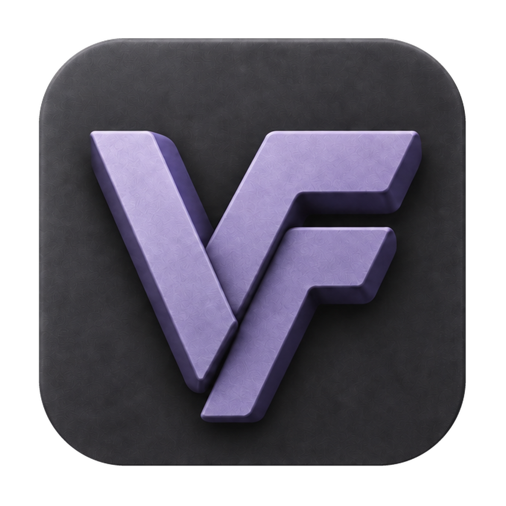
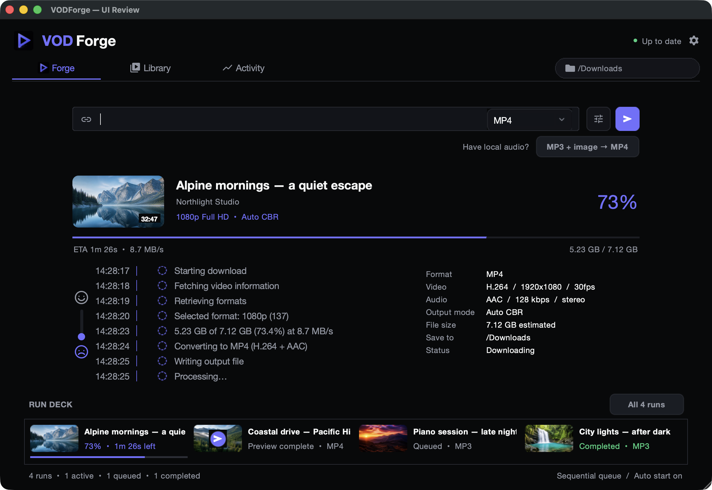
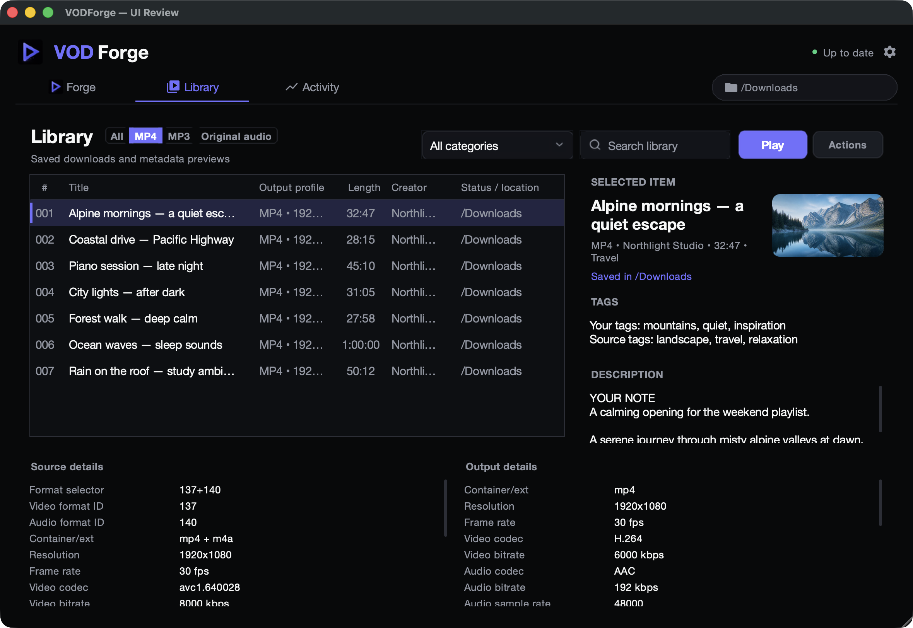

<p align="center">
  
</p>
<h1 align="center">VODForge</h1>
<p align="center">Your media. Ready to play.</p>
<p align="center">
  <a href="https://getvodforge.com/"></a>
  <a href="https://github.com/SnowfallHD/vodforge/releases/latest"></a>
  <a href="https://github.com/SnowfallHD/vodforge/actions/workflows/tests.yml"></a>
  <a href="LICENSE"></a>
</p>
<p align="center">Windows · macOS · Native desktop app · No Electron</p>

Turn YouTube videos and playlists into organized **MP4 video**, **MP3 audio**, or
**Original audio**. Choose your quality, follow clear progress, and keep everything
in a searchable Library with built-in playback.



> This README describes the current `main` branch. Screenshots show the actual
> native UI with sample content; unreleased features may not yet be in the
> [latest public download](https://github.com/SnowfallHD/vodforge/releases/latest).

[Install](#install-a-packaged-release) · [Using VODForge](#using-vodforge) ·
[Privacy](#privacy-and-usage-analytics) · [Welcome & feedback (development)](docs/welcome-feedback-reviews.md) · [Development](#development) ·
[Architecture](docs/architecture.md)

## What it does

- Downloads individual videos, playlists, or a batch of URLs.
- Supports quality caps from 360p through 4K when the source provides them.
- Defaults to source-aware **Auto CBR** with resolution-specific bitrate floors and caps.
- Includes **Strict Compliance** mode for fixed H.264 10 Mbps video and AAC 320 kbps audio.
- Offers a manual MP4 override when you need exact video bitrate, encoding speed, sample rate, channels, and AAC or MP3 audio settings.
- Embeds useful metadata and thumbnails in the MP4 when supported.
- Creates MP3 audio at 320 kbps CBR by default, with optional 256, 192, and 128 kbps profiles plus source, 48 kHz, or 44.1 kHz sample-rate and source, stereo, or mono channel settings.
- Preserves the best available supported audio stream with **Original audio**: Opus becomes `.opus`, AAC becomes `.m4a`, without another lossy encoding step. It does not force either codec or make the source lossless.
- Embeds standard ID3 title/artist metadata by default. Cover art defaults to **No Art**, with explicit choices for the YouTube thumbnail or a custom image; MP3 mode still leaves one final audio file rather than a separate cover image.
- Turns a local MP3 plus a selected still image into an offline H.264/AAC MP4, with dedicated 720p, 1080p, 4K, and strict 2 Mbps profiles. Results go directly into the selected output folder.
- Searches the Library and organizes saved items with private notes, tags, and reusable categories.
- Plays saved MP4, MP3, and Original audio inside VODForge using bundled libVLC, with one synchronized audio/video clock, custom controls, chapters, heatmaps, and preview moments where available.
- Offers live theme and accent-color choices while preserving the familiar Forge, Library, and Settings layout.
- Writes a compact, readable `metadata.json` beside each video.
- Keeps playlist and non-playlist downloads organized in collision-safe, path-length-aware folders that retain recognizable channel, playlist, and video titles.
- Ignores playlist expansion by default so a copied watch link downloads only that video or audio item; turn **Ignore playlists** off when you intentionally want every item in a playlist.
- Keeps YouTube access explicit: **Public** uses no cookies, while `cookies.txt` and **Browser** are separate opt-in methods for content you are authorized to access.
- Shows friendly progress stages in Forge, with a vertical smile/frown control to switch to the styled technical log. Activity retains the full technical view.
- Combines private local download history across app restarts with current-session metadata previews, output-type filters, a pixel-scrolling table, and draggable session-persistent columns.
- Keeps each Forge run's format and output details stable while the output dropdown and Settings configure only the next run.
- Reflects the latest Library items in Run Deck as playlist items finish, without waiting for the entire playlist. Skipping an item follows the next playlist item when one remains.
- Showcases selected features in an in-app **What's new** carousel. Routine version bumps do not trigger a new showcase; X or Escape dismisses the current showcase durably.
- Lets preview items start downloads directly, failed items retry, skipped or stopped items restart as fresh runs, and Library removal stop only the exact active or queued run it owns without deleting downloaded media.
- Checks versioned, stable GitHub Releases automatically after startup and every six hours; it never installs code directly from the repository's `main` branch.

## Install a packaged release

Get VODForge from the [website](https://getvodforge.com/) or
[GitHub Releases](https://github.com/SnowfallHD/vodforge/releases/latest).
Packaged downloads include the required runtimes; you do not need Python to use them.

GitHub Releases are the intended public download channel. Release notes put the recommended **Newer Macs — Apple silicon** download first (usually late 2020 and newer), followed by **Older Macs — Intel-based** (generally 2020 and earlier) and **Windows**. Because model years overlap, Mac users should rely on **About This Mac**: choose Apple silicon when it shows **Chip**, and Intel when it shows **Processor**.

On Windows, use the per-user `VODForge-Windows-Setup` installer. It installs under `%LOCALAPPDATA%\Programs\VODForge`, keeps the packaged `_internal` runtime beside the app automatically, adds normal shortcuts, and provides an uninstaller. The portable ZIP remains available for users who specifically want it.

The macOS release is a normal `VODForge.app`; its bundled runtime is inside the application package. Public macOS releases are Developer ID signed, notarized, stapled, and Gatekeeper-checked before publication. Unsigned workflow artifacts are explicitly named `unsigned-review` and are never public-ready downloads.

## Run from source

You need Python 3.11 or newer with Tk support.

### macOS

Homebrew is used to install a Tk-enabled Python, FFmpeg, and Deno. The application remains a lightweight Python/Tk desktop app; it does not require Electron.

```bash
git clone https://github.com/SnowfallHD/vodforge.git
cd vodforge
./install_macos_dependencies.sh
.venv/bin/python main.py
```

### Windows

```powershell
git clone https://github.com/SnowfallHD/vodforge.git
cd vodforge
python -m venv .venv
. .\.venv\Scripts\Activate.ps1
python -m pip install -r requirements.txt
.\install_ffmpeg_windows.ps1
.\install_deno_windows.ps1
.\install_vlc_windows.ps1
python main.py
```

FFmpeg is required. Deno is strongly recommended because current YouTube extraction increasingly relies on a JavaScript runtime.

## Using VODForge

1. Paste one YouTube URL, choose a playlist URL, or load a text file containing one URL per line.
2. Choose **MP4**, **MP3**, or **Original audio** from the dropdown at the right edge of the URL field.
3. Pick an output folder. For MP4, choose a quality cap and export mode. For MP3, the default is 320 kbps; sample-rate and channel controls are in Settings. Original audio preserves the selected stream and has no re-encoding controls.
4. Start or queue the run.

For local audio, use **MP3 + image → MP4** beneath the Forge URL field. Choose one MP3 and one JPG, PNG, or WebP still; VODForge renders the image as the video for the full length of the audio. The original files are unchanged, and the finished MP4 is written directly to the selected output folder—no channel or item parent folder is added—then appears in Library's MP4 view.

On current main, the dialog reserves its full Image preview frame before selection. **Choose folder** changes the shared save directory, and **All N runs** opens Library. The composer's format dropdown is inline after a divider; these refinements are not yet in the published 0.1.9 release.

This converter has its own saved output profile, independent of the YouTube download settings: **1080p Standard** uses efficient still-image compression, **2160p 4K** renders at 3840×2160, **720p Compact** reduces resolution, and **1080p Strict 2 Mbps CBR** provides a fixed-rate option. Each uses 30 fps H.264 with two-second keyframes and AAC audio. Increasing resolution cannot restore detail absent from the selected image.

Forge keeps active, queued, completed, previewed, stopped, and failed attempts under separate run identities. Selecting an older card does not overwrite the current run, and changing the output type or settings does not rewrite the selected card's recorded format. Preview, retry, and restart actions always enter the normal sequential run queue as fresh attempts.

Quality caps use the provider's named tier when available, rather than requiring
an exact frame height. For example, a wide `1920×1012` stream labeled **1080p**
by YouTube is eligible at 1080p. VODForge preserves aspect ratio; it does not add
pixels just to make the height read 1080.

### A Library that stays yours



Library combines saved history and metadata-only previews. Its table scrolls by pixels and its column dividers can be dragged without changing the meaning of the columns. The **Actions** menu provides copy/open commands and, where applicable, **Start download in Forge**. Removing an item removes its VODForge Library and Forge presentation history; if that row owns an exact active or queued run, that run is stopped or dequeued, while unrelated runs and media files remain untouched.

Use Library search and the category filter to find items. **Organize this item** saves your own notes, tags, and category locally without changing the source's metadata. Categories are user-created collections, and saved category names can be reused for other items.

**Play** opens the internal player on the saved artwork; press its Play overlay to begin. Playback works offline with no separately installed player. Chapters, heatmaps, and preview moments appear when their metadata or local media supports them. If a file was moved or deleted, the recovery prompt can send it back to Forge using its saved export settings and original base output folder. Existing channel/playlist/item folders are reused instead of nesting the same hierarchy again; older records without a usable saved profile require review.

Theme presets and custom accents apply immediately in Settings. Trackpad scrolling works throughout the Settings body, with the action footer kept visible.

## Privacy and usage analytics

Library history, annotations, and downloaded media stay on your computer.
**Share anonymous analytics** in Settings controls optional installation, update,
attribution, and usage telemetry—not just recurring usage events. Turning it off
also clears pending usage events. Checking for app updates remains a separate
functional request; it is not permission to send analytics.

Onboarding evaluates the region policy once and saves the decision locally.
Opt-in and unknown regions require a choice before analytics can be sent;
eligible default-on regions may enable it unless the user has declined.
An explicit choice in Settings persists. Existing installations migrate their
local state and evaluate the policy if needed without becoming new installs or
reopening the first-install browser-link flow.

Permitted telemetry uses random installation identifiers and coarse app facts;
it excludes media URLs, titles, filenames, paths, searches, notes, tags, and
playback positions. The first-install thank-you page can open independently of
consent, but attribution requires permission. Closing that tab does not cause it
to reopen for late consent. See the [privacy notice](https://getvodforge.com/privacy/)
and [local-state ownership](docs/architecture.md#privacy-and-onboarding-state).

## Output and local files

Typical output:

```text
<output>/
└── <channel>/
    ├── playlists/
    │   └── <playlist>/
    │       └── <video title> [video-id]/
    │           ├── <video title>.mp4
    │           ├── metadata.json
    │           └── thumbnail.jpeg
    └── videos - no playlist/
        └── <video title> [video-id]/
            ├── <video title>.mp4
            ├── metadata.json
            └── thumbnail.jpeg
```

MP3 uses the same channel, playlist, and item folders, but its default output is intentionally a single file:

```text
<output>/<channel>/<playlist-or-videos-folder>/<item title> [video-id]/<item title>.mp3
```

The artwork shown for MP3 items in Forge and Library is kept in VODForge's private per-user thumbnail cache and is not written beside the MP3. A selected custom cover becomes the item's cached VODForge artwork; otherwise VODForge uses the YouTube thumbnail for its UI even when **No Art** leaves that thumbnail unembedded.

Original audio uses the same organized item folders with `.opus` or `.m4a`
according to the selected source codec. It does not apply MP3 bitrate, ID3, cover,
sample-rate, or channel conversion settings.

Diagnostics are written to `%LOCALAPPDATA%\VODForge\logs\` on Windows and `~/Library/Logs/VODForge/` on macOS.

Completed-download history is written to `%LOCALAPPDATA%\VODForge\download-history.json` on Windows and `~/Library/Application Support/VODForge/download-history.json` on macOS. It contains an allow-listed copy of display metadata, sanitized public URLs, media type, and the saved output folder. It never stores cookie files, cookie contents, authentication tokens, passwords, or browser-session data. An unavailable external drive is not mistaken for deleted media. If media was actually moved or removed, downloading the same item again replaces the stale saved-location record instead of creating a duplicate.

## Build the Windows app

Install the portable dependencies, then build and smoke-test:

```powershell
.\install_ffmpeg_windows.ps1
.\install_deno_windows.ps1
.\install_vlc_windows.ps1
.\build_windows.ps1
.\smoke_launch.ps1
```

The runnable folder is created at:

```text
dist\VODForge\
```

To build the primary per-user installer and the optional portable ZIP, install Inno Setup 6 and run:

```powershell
.\build_and_package_windows.ps1 -Version "0.1.0"
```

Use `-PortableOnly` only when you intentionally do not want an installer.

## Build the macOS app

Install dependencies, build the `.app`, and run its offline runtime smoke test:

```bash
./install_macos_dependencies.sh
./build_macos.sh
```

Local/source builds disable production telemetry regardless of their version string.
Only release builds explicitly set `VODFORGE_BUILD_TELEMETRY=production`; the
result is bundled as `VODFORGE_TELEMETRY_POLICY` on macOS and Windows. Keep this
unset when building a replacement app for testing, even with a stable version.
For journeys against a release artifact, set `VODFORGE_DISABLE_TELEMETRY=1` for
the launched process. The engineering-quality packaged E2E harness also suppresses
telemetry through its existing `VODFORGE_QUALITY_E2E` flag. These overrides never
mark a real first launch as delivered or change the user's analytics preference.

The local unsigned application is created at:

```text
dist/VODForge.app
```

To package an unsigned ZIP for internal testing:

```bash
./build_and_package_macos.sh 0.1.0
```

The build bundles FFmpeg, ffprobe, Deno, and the pinned libVLC runtime so downloads and synchronized in-app playback do not depend on shell `PATH` configuration or an installed external player. Public distribution still requires an Apple Developer ID signature and notarization; the build scripts do not claim or perform those steps.

## Release workflow

The manually dispatched **Build Release Draft** GitHub Actions workflow builds:

- a Windows per-user installer;
- an optional Windows portable ZIP;
- separate Apple Silicon and Intel macOS review archives; and
- `SHA256SUMS.txt` for every artifact.

It creates a GitHub **draft** release only. Windows application and installer signing uses Azure Artifact Signing through a repository-specific OIDC identity; no long-lived Azure password is stored in GitHub. The macOS jobs produce explicit unsigned review archives for both architectures. On the signing Mac, `./finalize_macos_release.sh <version>` downloads those review builds, Developer ID signs them, submits each to Apple notarization, staples and Gatekeeper-checks them, runs the packaged-runtime smoke tests, uploads the final archives, removes the unsigned review assets, and regenerates `SHA256SUMS.txt`.

After the draft assets and checksums are reviewed, publishing the draft makes it the update source. Packaged apps check only the latest public, stable GitHub Release after startup and every six hours, while retaining the manual **Check for updates** control. When a newer version is approved by the user, Windows downloads the matching installer, verifies its exact size, SHA-256 checksum, Kryden Ventures Authenticode publisher, and trusted timestamp, then starts the silent installer. macOS downloads the matching architecture, verifies its size and checksum, exact VODForge bundle and Apple team identities, strict Developer ID signature, stapled notarization ticket, and Gatekeeper acceptance, then uses a detached rollback-capable swapper to replace and relaunch the app.

## Development

Windows:

```powershell
python -m venv .venv
. .\.venv\Scripts\Activate.ps1
python -m pip install -r requirements-dev.txt
python -m pytest -q
python -m compileall -q yt_downloader main.py
```

macOS:

```bash
./install_macos_dependencies.sh
.venv/bin/python -m pytest -q
.venv/bin/python -m compileall -q yt_downloader main.py macos_smoke_test.py
.venv/bin/python macos_smoke_test.py
```

The test suite focuses on export planning, FFmpeg command construction, metadata, path safety, batch parsing, cookie options, diagnostics, and source-format fallbacks.

`yt-dlp` and its matching EJS challenge scripts are pinned in `requirements.txt` so every Windows and macOS artifact uses the same reviewed extractor. YouTube changes frequently, so update that pin deliberately during normal app maintenance, then run the full suite and the packaged metadata-only probe (`VODForge --debug-preflight <public-test-url>`) before releasing. VODForge leaves YouTube player-client selection to the pinned `yt-dlp` version; do not hard-code a client list without a current cross-video format-availability test.

## Important notes

- Available resolutions and formats depend on the source video and YouTube.
- A larger output bitrate cannot restore detail that was not present in the source.
- YouTube audio is already compressed. The 320 kbps MP3 default minimizes additional encoding loss, but it cannot become lossless or restore source detail.
- Choose Original audio to avoid that additional lossy encoding step. MOV and other output containers are not currently offered.
- Browser-cookie and `cookies.txt` access run through `yt-dlp`; only the selected method is active, and VODForge does not upload or store cookie contents.
- Download only content you own or have permission to use, and follow the applicable platform terms and laws.

## Contributing

Bug reports and focused pull requests are welcome. Please include reproduction steps for download failures and run `python -m pytest -q` before opening a PR. Never attach cookie files or diagnostics containing private URLs.

## License

VODForge source is MIT licensed — see [LICENSE](LICENSE). Bundled runtimes have their own licenses and distribution notices; see [THIRD_PARTY_NOTICES.md](THIRD_PARTY_NOTICES.md).
