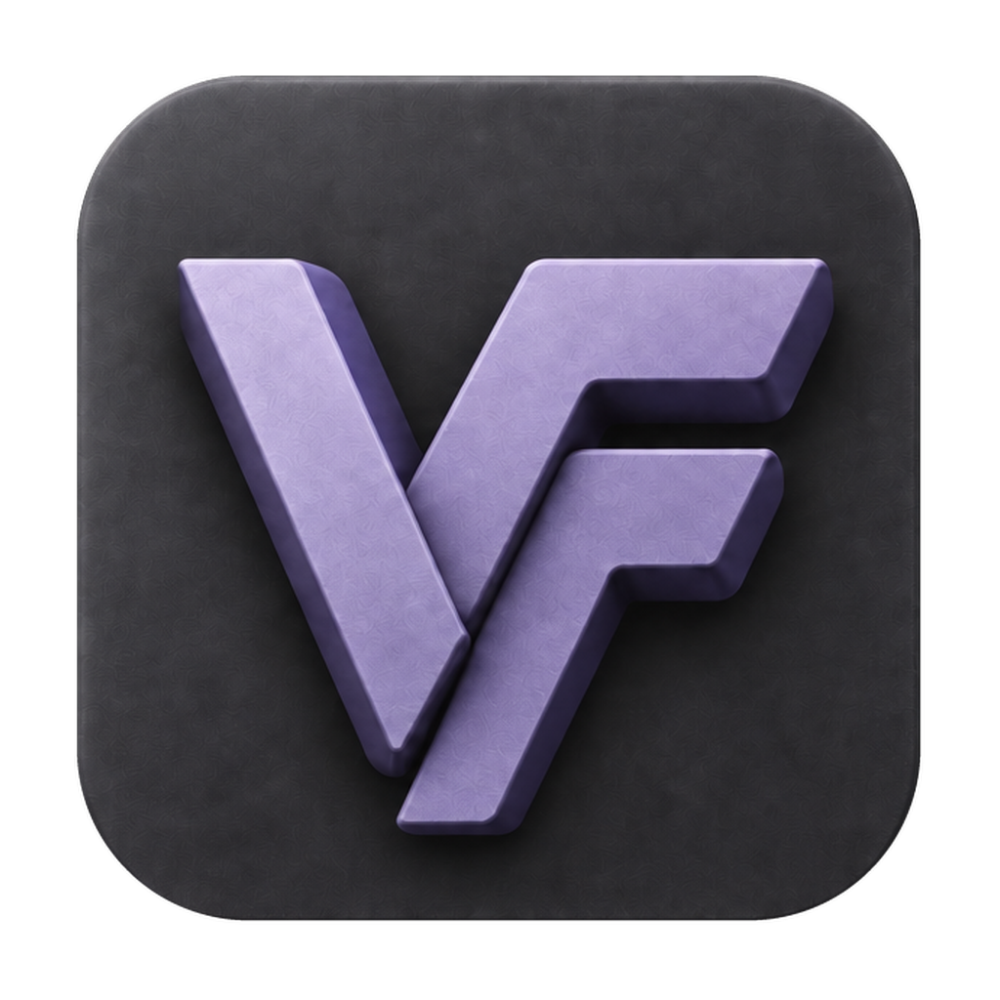
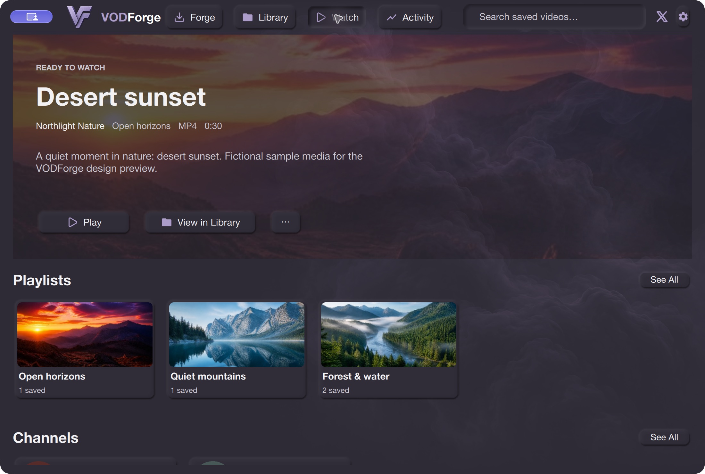
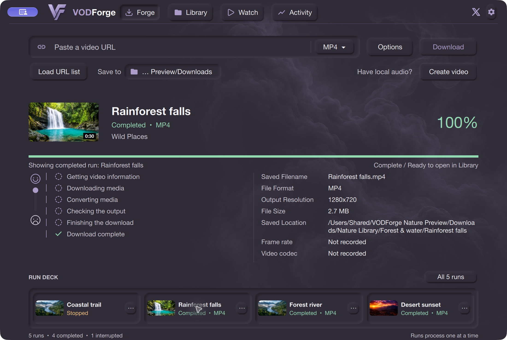
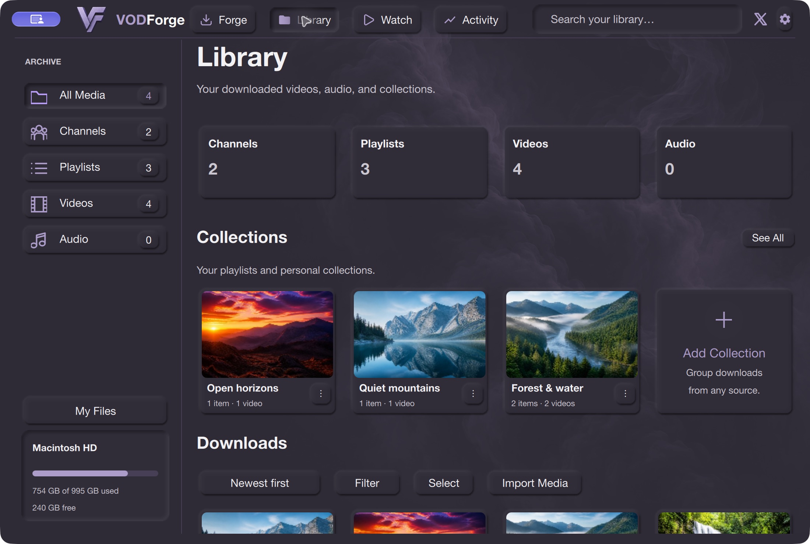
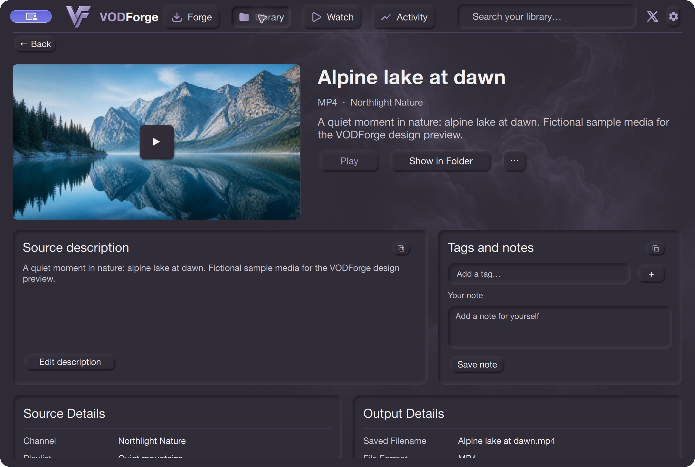
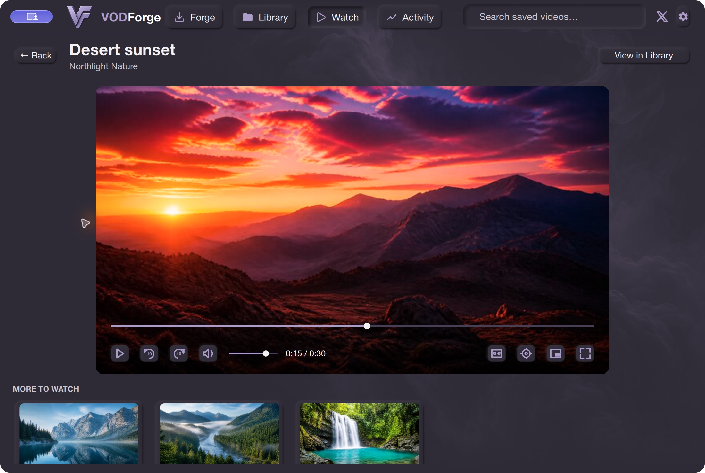
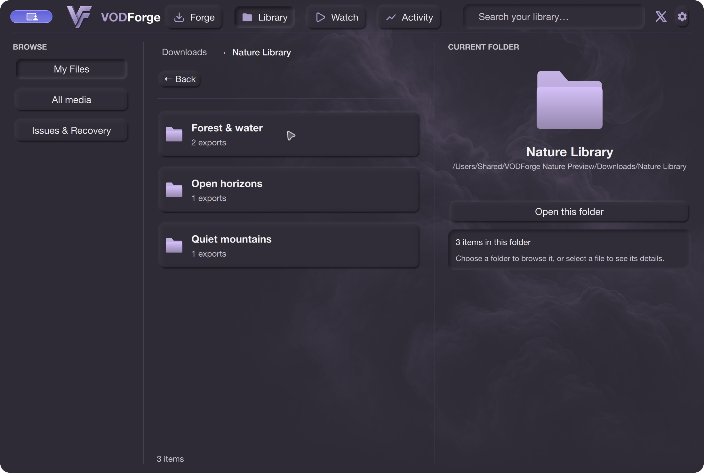
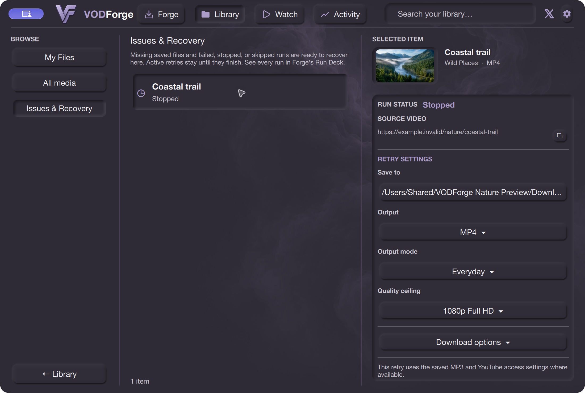

<p align="center">
  
</p>
<h1 align="center">VODForge</h1>
<p align="center">Your media. Your way.</p>
<p align="center">
  <a href="https://getvodforge.com/"></a>
  <a href="https://github.com/SnowfallHD/vodforge/releases/latest"></a>
  <a href="https://github.com/SnowfallHD/vodforge/actions/workflows/tests.yml"></a>
  <a href="LICENSE"></a>
</p>
<p align="center">Windows · macOS · Native desktop app · No Electron</p>

Turn YouTube videos and playlists into organized **MP4 video**, **MP3 audio**, or
**Original audio**. Choose your quality, follow clear progress, and keep everything
in a searchable Library with built-in playback.



> These native screenshots show the Qt Quick interface with a fictional nature
> library. See the latest release for the available version. No personal media
> appears in these assets.
> [Screenshot provenance](assets/readme/current-design/manifest.json) · [Press assets](https://getvodforge.com/press/)

[Install](#install-a-packaged-release) · [Using VODForge](#using-vodforge) ·
[Privacy](#privacy-and-usage-analytics) · [Welcome & feedback](docs/welcome-feedback-reviews.md) · [Development](#development) ·
[Architecture](docs/architecture.md) · [Fine-tuning](fine-tuning/README.md)

## For humans

Start with install and usage below. For development, follow [Development](#development),
[architecture and repository map](docs/architecture.md), the
[shared UI catalog](docs/ui-components.md) and [current product guide](docs/current-design.md), and
[harness operating and maintenance guide](engineering-quality/HARNESS_GUIDE.md), with
[testing setup and commands](engineering-quality/README.md).
The [release gate](engineering-quality/RELEASE_GATE.md) defines required evidence.
The [Mac/Windows owner map](docs/architecture.md#shared-product-and-native-implementations)
separates native implementations while keeping one shared product UI and behavior contract.

## The current app

### Forge: save and follow every run

Paste a video URL or load a list, choose **MP4**, **MP3**, or **Original audio**, and
choose where to save it. **Options** holds output modes, quality ceilings and access
settings. Custom reveals its controls directly below the choice. Use **Create video**
to turn local audio and a still image into an MP4.

The activity view keeps the steps that actually happened, including completed and
interrupted runs. Switch to Technical for the detailed, vertically scrolling log.
The Run Deck shows artwork, state and progress; **All N runs** opens the full scrollable
card list. Active and queued work, stopped/canceled, failed and skipped runs remain
visible alongside completed exports. Removing a queued item removes that item.



### Library: find it and keep the details

Browse saved video and audio, channels, playlists and personal collections. Search is
scoped to Library. Item details keep source descriptions, tags, private notes, saved
versions and output facts together. Copy controls preserve full source URLs and text.
Local description edits retain the original provider information.





### Watch: a place for your saved media

Continue a video, browse playlists and channels, or play something from your library.
Each empty section keeps its own placeholders, even when other sections contain media.
**See All** becomes available when that section has at least one real item.

The internal player preserves the full picture in Fit mode, supports playback controls
and local previews, and returns to the route that opened it. More to Watch and source
and output information remain accessible around the player.



### My Files: browse locations on your computer

Open local storage from Library to browse My Files. Folder navigation replaces the
current listing without moving neighboring panes. The one-line path exposes hidden
ancestors through its overflow menu; compact **Back** sits below it. The right side
shows the current folder or selected file and **Open this folder** opens that exact
location. Select a video, thumbnail or metadata file for its relevant details.



### Issues & Recovery: resolve interrupted runs and missing files

The recovery list surfaces failed, stopped/canceled and skipped attempts without a
saved export, plus missing saved media. Select an issue
to locate moved media or retry using its recorded configuration. The same output and
Custom controls used by Forge appear here. A retry stays in this view, updates its
state as work advances, and leaves the list only after success. Ordinary new downloads
are not added to recovery just because they are running.



The app uses shared vector symbols, floating popup shadows and native control
semantics. Support offers separate, plain checkboxes for a reply and optional deeper
diagnostics; submitting feedback is an explicit action. The quiet X emblem beside
Settings opens [@VODForge](https://x.com/VODForge).

## Install a packaged release

Get VODForge from the [website](https://getvodforge.com/) or
[GitHub Releases](https://github.com/SnowfallHD/vodforge/releases/latest).
Packaged downloads include the required runtimes; you do not need Python to use them.

GitHub Releases are the intended public download channel. Release notes put the recommended **Newer Macs — Apple silicon** download first (usually late 2020 and newer), followed by **Older Macs — Intel-based** (generally 2020 and earlier) and **Windows**. Because model years overlap, Mac users should rely on **About This Mac**: choose Apple silicon when it shows **Chip**, and Intel when it shows **Processor**.

On Windows, use the per-user `VODForge-Windows-Setup` installer. It installs under `%LOCALAPPDATA%\Programs\VODForge`, keeps the packaged `_internal` runtime beside the app automatically, adds normal shortcuts, and provides an uninstaller. The portable ZIP remains available for users who specifically want it.

The macOS release is a normal `VODForge.app`; its bundled runtime is inside the application package. Public macOS releases are Developer ID signed, notarized, stapled, and Gatekeeper-checked before publication. Unsigned workflow artifacts are explicitly named `unsigned-review` and are never public-ready downloads.

## Run from source

You need Python 3.11 or newer. The current interface uses PySide6 / Qt Quick.
`qt_main.py` launches it explicitly. The retained `main.py` Tk entrypoint supports
older release workflows; it does not render the screenshots above.

### macOS

Homebrew is used to install a Tk-enabled Python, FFmpeg, and Deno. The application is a native Python/Qt desktop app; it does not require Electron.

```bash
git clone https://github.com/SnowfallHD/vodforge.git
cd vodforge
./install_macos_dependencies.sh
.venv/bin/python qt_main.py
```

### Windows

```powershell
git clone https://github.com/SnowfallHD/vodforge.git
cd vodforge
python -m venv .venv
. .\.venv\Scripts\Activate.ps1
python -m pip install -r requirements.txt
.\install_ffmpeg_windows.ps1
.\install_deno_windows.ps1
.\install_vlc_windows.ps1
python qt_main.py
```

FFmpeg is required. Deno is strongly recommended because current YouTube extraction increasingly relies on a JavaScript runtime.

## Using VODForge

1. Paste a YouTube URL or load a text file with one URL per line.
2. Choose the output format and save location.
3. Open **Options**, review the output mode and quality ceiling, and use Custom
   for explicit bitrate, codec, channel, sample-rate and encoding controls.
4. Choose **Download**, or queue the run while another is active.
5. Find the result in Library, play it in Watch, or browse its files in My Files.

Quality ceilings preserve aspect ratio and accept the source's named tier. A source
labeled 1080p can have a frame height below 1080; VODForge does not add pixels merely
to match a tier name. A 4K ceiling does not upscale smaller footage.

For local audio, choose **Create video**. Its own saved profile is independent of
YouTube output settings. It renders the still image for the audio's full duration
and writes the result directly to the selected folder. Source files remain intact.

### MP4 output settings

In **Forge → Options → Output mode**, choose the task you need:

| Setting | Use it for | CPU video policy |
| --- | --- | --- |
| **Everyday** | Watching, keeping, and general reuse; the new-profile default | CRF 21, five-second keyframes |
| **Streaming** | Playback in reaction or presentation workflows | Capped CRF 20, constant frame rate, two-second keyframes |
| **Editing** | Cutting and exporting again | CRF 18, constant frame rate, one-second keyframes |
| **Sharing** | Smaller files when some detail loss is acceptable | CRF 25, five-second keyframes |
| **CTV** | An upload master for a TV distribution workflow | Source-informed constrained CBR, two-second keyframes |
| **Custom** | A known delivery specification | Your CBR target or explicit x264 CRF |

Automatic presets use a suitable SDR source within your quality ceiling and
produce H.264 MP4 with AAC stereo. They preserve source dimensions and aspect
ratio; choosing 4K does not upscale a smaller source. Streaming exports a local
file, not a live stream; Editing remains H.264, not a mezzanine format.

CPU encoding is the default. Windows users can enable **NVIDIA GPU** for
separately tuned NVENC quality controls: CQ 24/23/20/27 for Everyday, Streaming,
Editing, and Sharing. CRF and CQ are different scales; GPU speed, file size and
quality differ from CPU results. Custom CRF stays on CPU. Automatic CTV allows
encoder-specific bitrate headroom while retaining the measured 2,000 kbps video
minimum for the 1080p tier. Quiet AAC can legitimately measure below its target.

Existing Auto CBR settings become **CTV**, and manual settings become **Custom**.
Your saved history and retry profiles remain interpretable. See the
[preset specification](docs/export-presets.md), [fine-tuning results](fine-tuning/results/2026-09-10-nvenc-report.md),
and [measured export guide](https://getvodforge.com/mp4-export-settings/).

### Failures and updates

Failures pair a plain-language explanation with a practical next step. Switch
to **Technical** for the recorded cause and process details; older records that
lack those details say so. NVIDIA failures explain how to retry with CPU encoding.

Updates close and relaunch the app automatically after verified installation.
Windows targets the running app’s folder even when another copy is registered,
and the helper runs without a PowerShell console. If installation fails, use
**Repair VODForge** where offered to download and verify the latest official
installer. Repair backs up saved app data and checks preservation before relaunch;
it does not move or delete your media. **Open download page** provides a manual
route. See [updater recovery](docs/update-handoff.md).

### A Library that stays yours

Notes, tags, collections and edited descriptions are saved locally. Library's file
and management actions remain scoped to the captured item. Moving carries saved
annotations and playback progress; deleting uses system Trash where available and
requires confirmation. Removing a Library entry alone preserves its files. Missing
media is handled through Issues & Recovery, with saved configuration available for
redownload when recorded. An unavailable external drive is distinguished from a
confirmed missing file.

## Privacy and usage analytics

Library history, annotations, and downloaded media stay on your computer.
**Share usage analytics** in Settings controls optional installation, update,
attribution, and usage telemetry—not just recurring usage events. Turning it off
also clears pending usage events. Checking for app updates remains a separate
functional request; it is not permission to send analytics.

Onboarding evaluates the region policy once and saves the decision locally.
Opt-in and unknown regions require a choice before analytics can be sent;
eligible default-on regions may enable it unless the user has declined.
An explicit choice in Settings persists. Existing installations migrate their
local state and evaluate the policy if needed without becoming new installs or
reopening the first-install browser-link flow.

Permitted telemetry uses random installation identifiers, opaque attempt/retry
identifiers, and bounded app/system facts. It covers export presets and encoders, bucketed
media size/duration and processing time, queue/recovery outcomes, Library/player
feature use, and verified updater outcomes. Feature actions record usage only;
it excludes media URLs, titles, filenames, paths, searches, notes, tags, and
playback positions. The first-install thank-you page can open independently of
consent, but attribution requires permission. Closing that tab does not cause it
to reopen for late consent. See the [privacy notice](https://getvodforge.com/privacy/)
and [local-state ownership](docs/architecture.md#privacy-and-onboarding-state).

App-open and failure observations include numeric OS/Python/Qt/downloader versions,
processor architecture and logical CPU count, total/available memory in MB, and
the exact build revision when available. Windows NVIDIA driver context reuses the
existing capability probe; unavailable GPU facts remain unknown. Failures retain
a bounded first-party call chain and observed cookie failure category. Filesystem
errors can include path style, length and component sizes, never path contents.

Support reports have separate, unchecked options for recent diagnostics, a
canonical YouTube source link, and the output folder path (with diagnostics).
The review shows the selected attachments. YouTube links can identify private or
unlisted content; folder names can identify people or projects. Cookies, tokens,
whole logs, downloaded contents, native replay and memory dumps are not attached.


## Output and local files

Typical output:

```text
<output>/
└── <channel>/
    ├── playlists/
    │   └── <playlist>/
    │       └── <video title> [video-id]/
    │           ├── <video title>.mp4
    │           ├── metadata.json
    │           └── thumbnail.jpeg
    └── videos - no playlist/
        └── <video title> [video-id]/
            ├── <video title>.mp4
            ├── metadata.json
            └── thumbnail.jpeg
```

MP3 uses the same channel, playlist, and item folders, but its default output is intentionally a single file:

```text
<output>/<channel>/<playlist-or-videos-folder>/<item title> [video-id]/<item title>.mp3
```

The artwork shown for MP3 items in Forge and Library is kept in VODForge's private per-user thumbnail cache and is not written beside the MP3. A selected custom cover becomes the item's cached VODForge artwork; otherwise VODForge uses the YouTube thumbnail for its UI even when **No Art** leaves that thumbnail unembedded.

Original audio uses the same organized item folders with `.opus` or `.m4a`
according to the selected source codec. It does not apply MP3 bitrate, ID3, cover,
sample-rate, or channel conversion settings.

Diagnostics are written to `%LOCALAPPDATA%\VODForge\logs\` on Windows and `~/Library/Logs/VODForge/` on macOS.

Completed-download history is written to `%LOCALAPPDATA%\VODForge\download-history.json` on Windows and `~/Library/Application Support/VODForge/download-history.json` on macOS. It contains an allow-listed copy of display metadata, sanitized public URLs, media type, and the saved output folder. It never stores cookie files, cookie contents, authentication tokens, passwords, or browser-session data. An unavailable external drive is not mistaken for deleted media. If media was actually moved or removed, downloading the same item again replaces the stale saved-location record instead of creating a duplicate.

## Build the Windows app

Install the portable dependencies, then build and smoke-test:

```powershell
.\install_ffmpeg_windows.ps1
.\install_deno_windows.ps1
.\install_vlc_windows.ps1
$env:VODFORGE_UI = "qt"
.\build_windows.ps1
.\smoke_launch.ps1
```

The runnable folder is created at:

```text
dist\VODForge\
```

To build the primary per-user installer and the optional portable ZIP, install Inno Setup 6 and run:

```powershell
.\build_and_package_windows.ps1 -Version "0.1.0"
```

Use `-PortableOnly` only when you intentionally do not want an installer.

## Build the macOS app

Install dependencies, build the `.app`, and run its offline runtime smoke test:

```bash
./install_macos_dependencies.sh
VODFORGE_UI=qt ./build_macos.sh
```

Local/source builds disable production telemetry regardless of their version string.
Only release builds explicitly set `VODFORGE_BUILD_TELEMETRY=production`; the
result is bundled as `VODFORGE_TELEMETRY_POLICY` on macOS and Windows. Keep this
unset when building a replacement app for testing, even with a stable version.
For journeys against a release artifact, set `VODFORGE_DISABLE_TELEMETRY=1` for
the launched process. The engineering-quality packaged E2E harness also suppresses
telemetry through its existing `VODFORGE_QUALITY_E2E` flag. These overrides never
mark a real first launch as delivered or change the user's analytics preference.

The local unsigned application is created at:

```text
dist/VODForge.app
```

To package an unsigned ZIP for internal testing:

```bash
./build_and_package_macos.sh 0.1.0
```

The Qt build bundles FFmpeg, ffprobe, Deno, and Qt Multimedia playback dependencies.
The retained Tk build bundles libVLC. Neither requires an external player or shell
`PATH` configuration for packaged playback. Public distribution still requires an Apple Developer ID signature and notarization; the build scripts do not claim or perform those steps.

## Release workflow

The manually dispatched **Build Release Draft** GitHub Actions workflow builds:

- a Windows per-user installer;
- an optional Windows portable ZIP;
- separate Apple Silicon and Intel macOS review archives; and
- `SHA256SUMS.txt` for every artifact.

It creates a GitHub **draft** release only. Windows application and installer signing uses Azure Artifact Signing through a repository-specific OIDC identity; no long-lived Azure password is stored in GitHub. The macOS jobs produce explicit unsigned review archives for both architectures. On the signing Mac, `./finalize_macos_release.sh <version>` downloads those review builds, Developer ID signs them, submits each to Apple notarization, staples and Gatekeeper-checks them, runs the packaged-runtime smoke tests, uploads the final archives, removes the unsigned review assets, and regenerates `SHA256SUMS.txt`.

After the draft assets and checksums are reviewed, publishing the draft makes it the update source. Packaged apps check only the latest public, stable GitHub Release after startup and every six hours, while retaining the manual **Check for updates** control. When a newer version is approved by the user, Windows downloads the matching installer, verifies its exact size, SHA-256 checksum, Kryden Ventures Authenticode publisher, and trusted timestamp, then starts the silent installer. macOS downloads the matching architecture, verifies its size and checksum, exact VODForge bundle and Apple team identities, strict Developer ID signature, stapled notarization ticket, and Gatekeeper acceptance, then uses a detached rollback-capable swapper to replace and relaunch the app.

## Development

Two complementary harnesses make changes reviewable:

- [Engineering quality](engineering-quality/README.md) verifies application behavior,
  failure handling, validation, and real worker lifecycles.
- [Fine-tuning](fine-tuning/README.md) measures encoder quality, file size, and speed
  against common fixtures, preserving commands, hardware identity and results.
  Its experiments select settings; they do not replace regression or packaged tests.

Windows:

```powershell
python -m venv .venv
. .\.venv\Scripts\Activate.ps1
python -m pip install -r requirements-dev.txt
python -m pytest -q
python -m compileall -q yt_downloader main.py
```

macOS:

```bash
./install_macos_dependencies.sh
.venv/bin/python -m pytest -q
.venv/bin/python -m compileall -q yt_downloader main.py macos_smoke_test.py
.venv/bin/python macos_smoke_test.py
```

The suite covers export planning, output preservation, metadata, path safety,
queue and player lifetime, consent, and UI ownership/geometry. Native tests are
opt-in and separate from ordinary source tests; see the
[engineering guide](engineering-quality/README.md) for their environment and gates.
A passing source suite does not certify an installed application.

For a UI change, start with the [component catalog](docs/ui-components.md) and
[architecture](docs/architecture.md). The catalog's current design standard is
required for new features: choose controls by meaning, follow the shared owners
and composition rules, and complete its whole-view/state review. Checkboxes have
plain indicators and labels; action buttons never become checkbox containers.
Extend an existing owner, preserve a concrete
reproducer for confirmed bugs, and update the relevant mandatory harness class.
Test current-owner actions, cancellation, navigation, resize, and empty/small/large
content states. Keep technical details behind the action or view that needs them.
Record source identity and distinguish generated input, physical input, and exact
packaged evidence. Follow the [release gate](engineering-quality/RELEASE_GATE.md)
before producing a release.

`yt-dlp` and its matching EJS challenge scripts are pinned in `requirements.txt` so every Windows and macOS artifact uses the same reviewed extractor. YouTube changes frequently, so update that pin deliberately during normal app maintenance, then run the full suite and the packaged metadata-only probe (`VODForge --debug-preflight <public-test-url>`) before releasing. VODForge leaves YouTube player-client selection to the pinned `yt-dlp` version; do not hard-code a client list without a current cross-video format-availability test.

## Important notes

- Available resolutions and formats depend on the source video and YouTube.
- A larger output bitrate cannot restore detail that was not present in the source.
- YouTube audio is already compressed. The 320 kbps MP3 default minimizes additional encoding loss, but it cannot become lossless or restore source detail.
- Choose Original audio to avoid that additional lossy encoding step. MOV and other output containers are not currently offered.
- Browser-cookie and `cookies.txt` access run through `yt-dlp`; only the selected method is active, and VODForge does not upload or store cookie contents.
- Download only content you own or have permission to use, and follow the applicable platform terms and laws.

## Contributing

Bug reports and focused pull requests are welcome. Include the trigger, expected
and observed behavior, platform, and reproducible evidence. Run the relevant tests
and required harness classes, plus lint/type checks, and state any unavailable
native or packaged tier in the PR. The [UI catalog](docs/ui-components.md) and
[architecture](docs/architecture.md) are shared contributor requirements for humans
and AI agents. Never attach cookie files or diagnostics containing private URLs.

## License

VODForge source is MIT licensed — see [LICENSE](LICENSE). Bundled runtimes have their own licenses and distribution notices; see [THIRD_PARTY_NOTICES.md](THIRD_PARTY_NOTICES.md).
